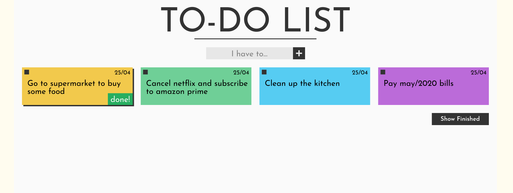

# To-Do List

Projeto realizado para a primeira parte do processo de trainee da Unect Jr. A ideia principal é criar uma to-do list, utilizando <strong>HTML</strong>, <strong>CSS</strong> e <strong>Javascript</strong>.

 Clique <a href="https://www.figma.com/file/hQxrrlxKO6CMF9pAMQoiYN/To-Do-List?node-id=0%3A1">aqui</a> para acessar o wireframe que criei para me basear durante o desenvolvimento do projeto.

